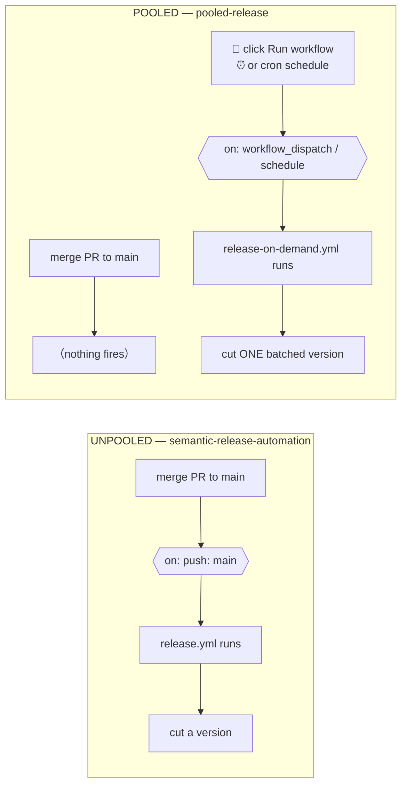
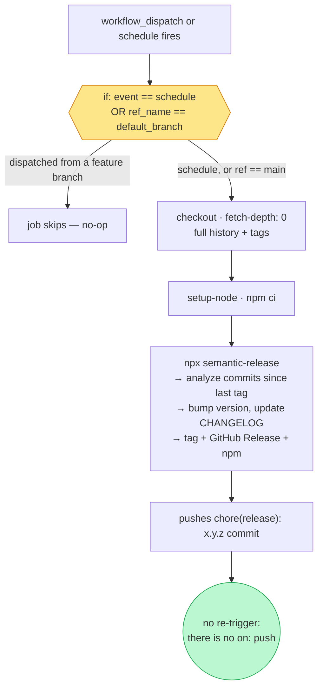

# Pooled vs unpooled releases — a visual walkthrough

A human-readable companion to [`../SKILL.md`](../SKILL.md). Same facts, drawn out.

The one idea to hold onto: **semantic-release always releases "everything since the
last tag." The pipeline is identical in both setups. The only thing that changes is
*when* it fires** — and that single change ripples into a few config differences.

## 1. What fires the release

In the unpooled setup, the **merge is the trigger**. In the pooled setup, the merge
is decoupled — it just lands commits on `main`; a separate human click or cron event
triggers the cut.



## 2. Same commits, different number of releases

This is the whole point — five merges map to a different number of releases:

```
                merge  merge  merge        merge  merge
  commits  ──────●──────●──────●────────────●──────●────────▶ time
                 │      │      │            │      │
  UNPOOLED      v1.1   v1.2   v1.3         v1.4   v1.5
  (per-push)     ▲      ▲      ▲            ▲      ▲
                 └ 5 merges  = 5 releases, 5 changelogs ┘

  POOLED                            ▼ Mon 09:00          ▼ click
  (on-demand)   ·······accumulate·······│·····accumulate·····│
                                      v1.1                  v1.2
                 └ 5 merges = 2 releases, 2 fat changelogs ┘
```

semantic-release does the batching in both cases. Pooling just means you **tag less
often**, so each tag sweeps up more commits into one readable changelog.

## 3. Inside the pooled job

The steps are byte-for-byte the same as the unpooled `release.yml`; only the
highlighted nodes differ.



## 4. The three config deltas — and why each one

Changing the trigger *forces* three downstream changes. This is the part that's easy
to get wrong if you only swap the `on:` line.

| Aspect | Unpooled (`release.yml`) | Pooled (`release-on-demand.yml`) | Why it changes |
|---|---|---|---|
| **Trigger** | `on: push: [main]` | `on: workflow_dispatch` (+ optional `schedule`) | The whole point — decouple merge from release |
| **Loop guard** | `if: !startsWith(… 'chore(release):')` **required** | **dropped** | semantic-release pushes a `chore(release):` commit. Under `on: push` that re-triggers the workflow → infinite loop. With no `push` trigger, nothing re-fires, so the guard is dead weight |
| **Branch guard** | not needed (push only ever comes from `main`) | `if: github.event_name == 'schedule' \|\| github.ref_name == default_branch` **added** | `workflow_dispatch` lets a human pick *any* branch in the Actions dropdown (or `gh workflow run --ref`). Without the guard, a manual run could analyze/publish from a feature or prerelease branch instead of `main`. The `schedule` clause is required: on cron runs `github.event.repository` is empty, so the bare ref check would be `main == ''` → false and skip every scheduled run |
| **Concurrency** | `group: release-${{ github.ref }}` (per-branch) | `group: release` (one global lane) | Pooled runs are pinned to `main` anyway, so the button and cron share one serialization lane and can't collide on the tag push |

## 5. Which one should you use?

```
                Releasing on every merge is fine?
                          │
              ┌───────────┴───────────┐
            YES                        NO  (too noisy / want readable changelogs)
              │                         │
        UNPOOLED                   POOLED — pick a trigger:
   (per-push release.yml)       ┌──────────┼─────────────┐
                            button       cron        prerelease
                       workflow_dispatch schedule    next/beta channel
                         (default)     (weekly)     (continuous pre +
                                                     promote to stable)
```

The honest summary: **pooled is not a different release engine.** It's the same
semantic-release pipeline with the trigger moved off `push`, plus the two guards that
swap as a *consequence* of that move — drop the loop guard, add the branch guard.
