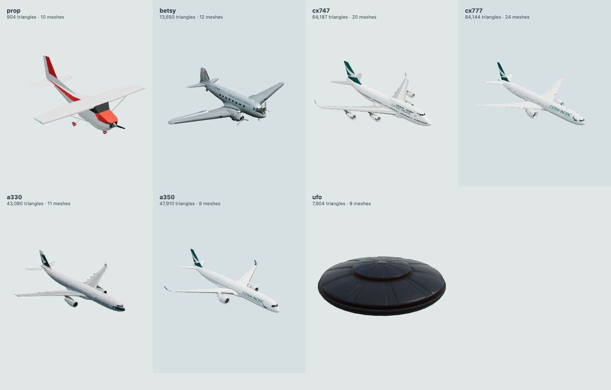

# Aircraft review and runtime improvements

GPT-6 Astra aircraft subagent, 6 September 2026. Seven bundled craft were inspected and improved in the Astra feature worktree. Original GLBs, original-game code and original textures remain unchanged. The new city loads its own normalised, batched runtime representation from those assets.



The contact sheet fits each aircraft to its own panel for inspection; it is not a comparison at one common scale. Dimensions below are the scale used inside the city.

## Fleet and changes

| Aircraft | Length × span in city | What the audit found | Implemented change |
| --- | --- | --- | --- |
| Generic light prop plane | 9.75 × 11.10 m, illustrative | Original city enlarged it to a universal 14 m maximum extent; propeller was static and paints were almost fully matte. | Fits a plausible light-plane size close to the source geometry, with its own turning propeller hub, paint response, nav lights and correctly scaled follow camera. The 584-triangle source remains visibly stylised. |
| Betsy, Douglas DC-3 | 19.66 × 28.96 m | Still, slow and blurred propeller variants were simultaneously visible; wheels and metal hull share a source material. | Removes eight duplicate variant meshes, centres each of the two propellers on its own hub, separates tyre/hull material treatment, restores a restrained bare-metal appearance, batches static pieces. |
| Boeing 747-400 | 70.67 × 64.44 m | Source nose faces +Z and the model lacks the -400's characteristic winglets; paint roughness is about 0.93; extended gear remains in the raw GLB. | Correct nose alignment, length/span fitting, two reconstructed 1.8 m winglets, appropriate painted/metal/glass response, airborne gear hiding, and hull-anchored lights. |
| Boeing 777-300ER | 73.86 × 64.80 m | Source nose faces −X; 246 separately drawn meshes; materials are mostly nearly matte; gear is extended. | Correct nose alignment and scale; 20 compatible hull/gear batches; tyre/paint response; gear hidden airborne; measured wingtip lights. The instantiated source geometry is retained rather than aggressively decimated again. |
| Airbus A330-300 | 63.66 × 60.30 m | Source nose faces +Z, has very matte textures and no authored extended landing gear. | Correct alignment and scale, improved paint reflections/filtering, seven hull batches and night navigation lights. Its gear-up source is suitable for this airborne city mode. |
| Airbus A350-1000 | 73.78 × 64.75 m | Source nose faces +X and includes extended gear; bounds computed from transformed sub-boxes slightly overestimate actual span. | Exact vertex bounds before length/span fitting, correct alignment, five hull/gear batches, airborne gear hiding and calibrated reflection strength. Existing curved winglets and livery are retained. |
| UFO, fictional | 18 × 18 m, illustrative | Source is about 0.20 units across and reads almost black without an environment reflection. | Explicit fictional scale, readable metal with a lightweight neutral reflection cube, subtle rim lights, proportionate chase camera. No real aircraft identity or specification is implied. |

Lengths and spans of named real types follow the primary sources below. Height follows the source hull's proportions after longitudinal scaling; it is not independently calibrated to a manufacturer's parked-height specification. All meshes remain approximations even when their overall dimensions match a published value. Navigation lights extend centimetres beyond the calibrated hull bounds.

The previous city only exposed the generic prop model. The new `AIRCRAFT` catalogue restores selection of all seven legacy craft; it does not restore every legacy craft-specific gameplay feature.

## Rendering and behaviour

- Runtime coordinates are +x right/east, +y up and −z forward. Source orientation correction precedes measurement and geometry batching.
- Length and span are fitted independently. Corrections to the source aspect ratios are small for the named real aircraft; no terrain or city scale is changed.
- Compatible static meshes are merged by material and role. Quantised UV/normal attributes are converted to a consistent float layout before merging; authored UVs, textures and colour-space settings are retained.
- Shared materials are separated when a tyre and hull require different treatment. This matters for Betsy, whose tyre geometry previously shared its hull material.
- Paint, glass, rubber and exposed metal receive different roughness/metalness. A small generated reflection cube improves material readability without downloading environment images. Its strength falls at night. This is an artistic sky/ground reflection, not a real-time reflection of Hong Kong buildings.
- Texture mipmaps and anisotropic filtering improve oblique livery legibility. They do not invent extra texture resolution.
- The generic propeller and both DC-3 props rotate about measured local hubs. Duplicate DC-3 blurred/slow variants are omitted. Reduced motion holds prop angle and makes the small beacon steady.
- Position lights are red on port, green on starboard and white aft. Wing and tail positions come from the loaded hull. The upper beacon uses a measured fuselage/wing surface near its intended position. Light size and intensity are visual approximations; there are no full-screen flashes.
- The 747 winglets follow the documented 1.8 m height; chord, sweep and root transition are approximate reconstructions. Their outer edges remain inside the configured overall span.
- Authored `CXGear` geometry on the 747, 777 and A350 is retained but hidden while airborne. The fixed/partly retracting appearance of the generic prop/DC-3 is retained in this pass. No new unsupported landing animation was invented.
- The follow-camera distance, pilot-eye offset and conservative collision envelope scale with the selected aircraft. Switching to a larger aircraft raises it if needed to clear nearby roofs; movement controls otherwise retain the city explorer's existing flight model.

## Integration API

`city/aircraft.js` exports `AIRCRAFT`, `aircraftById`, `AircraftModel`, `prepareAircraft`, `buildAircraftFallback` and `disposeAircraft`.

`Navigation` exposes:

```js
await nav.setAircraft('cx747');
nav.setAircraftLighting({night, reducedMotion});
const {id, status, dimensions, error} = nav.aircraftState;
```

`setAircraft` returns whether the detailed model loaded successfully. A failed or missing model leaves a type-specific simplified fallback in place, including when the optional NC files are absent. The state explicitly reports `fallback`; it does not label the stand-in as the detailed source model. Retry is possible by selecting the same aircraft again.

Selection tokens prevent late GLB requests replacing a newer choice. Replaced or cancelled models release geometry, materials and texture resources, including the generated reflection cube. Walk mode, terrain sampling and the character loader retain their existing behaviour.

## Primary dimensional and design sources

- [Boeing airport-planning manuals](https://www.boeing.com/commercial/airports/plan-manuals) provide the manufacturer's current document index.
- [Boeing 747-400/400ER, revision F](https://www.boeing.com/content/dam/boeing/v2/airports/acaps/747-400_Rev_F.pdf), General Dimensions, section 2.2.1: 70.67 m length and 64.44 m nominal span. Wing geometry varies with loading; one fixed visual scale is used here.
- [Boeing 777-200LR/300ER/777F, revision G](https://www.boeing.com/content/dam/boeing/v2/airports/acaps/777-200LR-300ER-F_Rev_G.pdf), section 2.2.2, printed page 2-4 / PDF page 18: 73.86 m length and 64.80 m span. This drawing was downloaded from Boeing and visually checked; the older search-indexed URL no longer worked.
- [Airbus A330-300](https://www.aircraft.airbus.com/en/aircraft/a330/a330-300): 63.66 m length and 60.30 m span.
- [Airbus A350-1000](https://www.aircraft.airbus.com/en/aircraft/a350/a350-1000): 73.78 m length and 64.75 m span on the current product page.
- [Smithsonian National Air and Space Museum, Douglas DC-3](https://airandspace.si.edu/collection-objects/douglas-dc-3/nasm_A19530075000): 95 ft span and 64 ft 6 in length, converted to 28.96 m and 19.66 m.
- [Farnborough Air Sciences Trust's actual 747-400 winglets](https://airsciences.org.uk/aircraft-on-display-boeing-747-400-winglets/) identifies their 6 ft / 1.8 m height. The museum pair supports the missing-part correction, not an exact CAD reconstruction.
- [FAA Airplane Flying Handbook, Night Operations](https://www.faa.gov/sites/faa.gov/files/regulations_policies/handbooks_manuals/aviation/airplane_handbook/12_afh_ch11.pdf), Figure 11-4, supports position-light colours and placement.

No archival Lantau maps or new external aircraft textures were used in this pass.

## Asset provenance and licences

The source model pages, authors and licences are recorded per aircraft in `AIRCRAFT` and in the original `3d-viewer/data/models/README.md`. Existing project-painted Cathay/Betsy liveries are retained; this pass changes their lighting response, filtering and placement scale, not their artwork.

- Generic prop: Vojtěch Balák, CC BY 3.0.
- Betsy/DC-3: OUTPISTON, CC BY-NC-SA 4.0, original file stays under `data/models/nc/`.
- 747-400: zairiqzairiq, CC BY 4.0; existing project Cathay repaint.
- 777-300ER: Omatar, CC BY 4.0; existing project Cathay repaint.
- A330-300: OUTPISTON, CC BY-NC-SA 4.0, original file stays under `data/models/nc/`.
- A350-1000: Newbie99999993, CC BY 4.0; existing project Cathay repaint.
- UFO: Islide, CC BY 4.0.

The NC restrictions are preserved, and previews that include those craft inherit their non-commercial/share-alike restrictions. Original model files are not relicensed by the runtime code. The original provenance README refers to `LICENSE-ASSETS.md`, but that file is absent from this checkout; the per-model README and catalogue therefore carry the relevant asset information directly.

## Validation and reproducible previews

```sh
node --test 3d-viewer/city/tests/aircraft.test.js
node 3d-viewer/city/tests/aircraft-browser.mjs
node 3d-viewer/city/tests/aircraft-audit.mjs
AIRCRAFT_AFTER=1 node 3d-viewer/city/tests/aircraft-audit.mjs
```

Eight unit tests cover the entire catalogue, source orientation, shared tyre/hull materials, load races, fallback/retry, disposal during load, reduced motion, night reflection strength and camera framing. The camera regression projects all seven aircraft bounds at desktop and 390 px / 320 px portrait aspect ratios, including 45° and 90° views. Chase distance derives from the effective horizontal field of view, projected span and fuselage depth, preserving the existing default desktop framing while keeping the wings visible on narrower screens. The Chrome WebGL test loads every real GLB with the city's logarithmic depth buffer and 100 km far plane. It checks hull dimensions to a 5 mm numerical fitting tolerance, side-correct lights, gear visibility, shader compilation and repeated selection. That numerical tolerance measures the implementation's scale transform; it does not make the source mesh accurate to 5 mm.

Measured aircraft draw calls in the isolated browser fixture:

| Prop | DC-3 | 747 | 777 | A330 | A350 | UFO |
| --- | --- | --- | --- | --- | --- | --- |
| 10 | 23 | 19 | 23 | 11 | 8 | 9 |

DC-3 transparency can draw both sides. Two full cycles through the fleet left renderer memory counters unchanged at 11 geometries / 8 textures with the final UFO active. Disposing the last aircraft returned to the renderer's internal reflection-processing baseline of 9 geometries / 2 textures.

Evidence is in `aircraft/source-audit.json`, `aircraft/improved-audit.json`, `aircraft/verification.json`, and the 1440 × 920 native-resolution `before.png` / `after.png` contact sheets. Every craft's orientation and appearance was inspected in those renders.

## Remaining work

The light prop source is still intentionally low-poly and needs a separately sourced higher-detail asset or original remodelling for a substantial silhouette upgrade. The new craft selection uses the city explorer's shared simplified flight handling: per-type aerodynamics, cruise speeds, cockpit interiors, airport take-off/landing, gear animation, prop motion blur, control-surface animation, UFO hovering/beam/gameplay and full original aircraft UI remain future parity work. No claim is made that this pass restores those functions.
