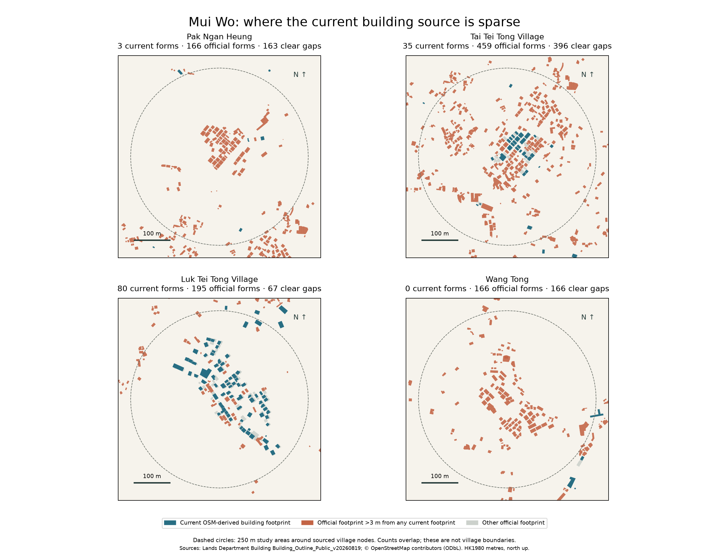

# Mui Wo official building coverage — HKS-164

Current detailed-model extension: [HKS-167 methods, source accounting and final views](extension/README.md) covers 1,327 verified models across seven adjoining sheets. The original 2,408 official footprints and all recorded elevations remain intact; notes below document the earlier footprint integration.

Produced by the Astra data agent for HKS-164 / Lantau HKS-122, 6 September 2026. This stages actual Lands Department footprints and recorded elevations for the root agent's official-primary city integration. Original OSM data, existing tiles, renderer and archival references were not changed by this pipeline.

## Result

The exact user-specified envelope `[113.97922444961371, 22.249711576500182, 114.0180525556901, 22.28564402349982]` returns **2,408 official records**. Independent `returnCountOnly`, complete `returnIdsOnly`, fetched OBJECTIDs and output component IDs agree. All 2,408 have a usable polygon component; none is removed for name, height, size or structure type.

| Official structure type | Retained forms |
| --- | ---: |
| Tower | 1,648 |
| Temporary Structure | 522 |
| Open-sided Structure | 227 |
| Podium | 11 |
| **Total** | **2,408** |

There are 2,185 unnamed forms. Both recorded elevations are usable in 1,967 forms. The remaining 441 are retained with explicit render estimates: 431 have neither elevation, and 10 retain the recorded top while estimating the base. Footprints as small as 1.413 m² are retained.

The frozen current-city comparison contains 318 OSM forms intersecting the exact user envelope, plus one neighbouring form in the 5 m comparison margin. This is a source coverage gap: the independent review found 330 underlying OSM building objects, with 12 explained exclusions (roof-only, construction and one tiny footprint), and no unexplained tile omission.

Our official-versus-OSM classification is 1,968 forms without an intersection above 0.01 m², 419 with substantial overlap, and 21 with only small edge overlap. These are advisory categories, not deletions. Root integration can use every official form as primary coverage and reconcile overlapping OSM extrusions while retaining their useful names/activity evidence. The [independent comparison](review/official-comparison.json) uses a stricter 3 m clearance screen and finds 1,894 clear gaps; those numbers answer a different question and should not be conflated.



The circles above are 250 m diagnostic catchments, not recognised-village or administrative boundaries. Main examples are Wang Tong, Pak Ngan Heung, Tai Tei Tong and Luk Tei Tong. The full user envelope remains the actual import scope, including its outer settlement areas.

## Before and after in the browser

The retained [original OSM coverage view](review/mui-wo-current-1600x1000.png) and [integrated government coverage view](review/mui-wo-live-official-overview-1600x1000.png) show Mui Wo from the matching 1600×1000 overview camera at 15:00. The original city had 117,062 forms territory-wide and 318 in the exact validation envelope. The local government integration checkpoint had 119,167 forms territory-wide, retaining all 2,408 official envelope records. Wider Hong Kong publication subsequently increases the territory total without changing this local source inventory.

The later `browser/before-*` and `browser/after-*` captures compare shelter rendering and detailed-model integration after the official footprint coverage had already been added; their corresponding JSON explicitly records 119,167 forms in both. The coverage before/after pair above documents the earlier source change.

## Sources, terms and precision

- [Lands Department official ArcGIS layer](https://portal.csdi.gov.hk/server/rest/services/common/landsd_rcd_1637211194312_35158/MapServer/0), dataset `landsd_rcd_1637211194312_35158`, `Building_Outline_Public_v20260819`.
- [Official metadata](https://portal.csdi.gov.hk/csdi-webpage/metadata/landsd_rcd_1637211194312_35158/html), revision 19 August 2026. The metadata describes a 1:1,000 mapping source and variable horizontal accuracy; this is not centimetre survey precision.
- [Official simplified data specification](https://static.csdi.gov.hk/csdi-webpage/view/common/6eda6a766520bcffe13206378c060a59bdb54a3c6f92480b1f01174d25fd7194) defines BaseHeight and TopHeight as approximate elevations above Hong Kong Principal Datum, in metres.
- Data from the **Lands Department, Hong Kong SAR Government; Common Spatial Data Infrastructure (CSDI) Portal**, under the [CSDI terms of use](https://portal.csdi.gov.hk/csdi-webpage/doc/TNC). The Government's intellectual property in the data is acknowledged. Rendered derivatives should carry this attribution and link.
- OSM comparison/source settlement labels: © OpenStreetMap contributors, [ODbL](https://www.openstreetmap.org/copyright). This pipeline reads retained snapshots and does not change them.

The official query requests native EPSG:2326 coordinates. World conversion is `x = E − 834500`, `z = 816500 − N`. Rings and holes are retained without simplification or clipping at the envelope; millimetre numeric formatting preserves supplied detail but does not imply millimetre accuracy. One source polygon (`landsd/312717`) required a self-touching geometry validity repair; the original rings remain in the compressed source snapshot. Multiple components and nested holes are supported.

The initial exploratory envelope returned 2,438 records and is retained under `initial-envelope-*` for audit. It is superseded by the exact 2,408-record user envelope and is not an additional runtime layer.

## Elevations and terrain conflicts

For complete source heights, `base = BaseHeight`, `height = TopHeight − BaseHeight`, `minimum = 0`, `heightSource = 'landsd'`. The original attributes plus `baseHeightHKPD` and `topHeightHKPD` remain unchanged. No source roof is raised to sit on the old terrain.

If elevations are missing, recorded Storeys × an assumed 3.2 m floor height is used where available. Otherwise the explicit visual defaults are Tower 9.6 m, Podium 4.5 m, Temporary Structure 3.5 m and Open-sided Structure 3.0 m. These are visual placeholders, not inferred surveys or claims about actual occupancy. A known source top stays fixed; if both values are missing the render base comes from the selected terrain minimum. `heightSource`, `heightRule` and `baseSource` distinguish every estimate. Root integration should recompute terrain-estimated bases when using the finer terrain patch.

Open-sided structures remain tagged separately (`structureType`, with `kind: 'roof'`). The footprint source does not supply detailed posts, roof thickness or a complete architectural model. Root rendering must avoid representing every shelter as an inhabited opaque tower.

Analytical terrain extrema are evaluated at footprint/terrain-triangle intersections. The staged `terrain` object is an audit of the original 70 m terrain; it does not overwrite source heights. Root subsequently supplied the official 5 m DTM patch, independently compared in [fine-terrain-audit.json](fine-terrain-audit.json).

| Terrain audit | 70 m mesh | 5 m patch |
| --- | ---: | ---: |
| Roof wholly below terrain | 594 | 208 |
| Roof below terrain somewhere | 800 | 403 |
| Base wholly above terrain | 46 | 35 |

The roof threshold is 0.1 m; base floating threshold is 0.5 m. Fine-patch totals recompute only explicitly estimated bases, preserving recorded elevations. Of the 1,967 forms with both recorded elevations, 205 roofs remain wholly below the fine terrain and 356 partly below. These are conflicts between datasets, **not evidence of underground buildings**. Of all forms, 41 roofs are wholly more than 5 m below and six more than 10 m below. Source footprints/elevations stay available; any terrain reconciliation or visibility treatment belongs to the explicit root integration policy.

## Reproduction and interface

From the Astra worktree with Shapely 2.1.2 and pyproj 3.8.0:

```sh
/tmp/astra-city-venv/bin/python source-scripts/city/mui-wo-buildings/fetch.py
/tmp/astra-city-venv/bin/python source-scripts/city/mui-wo-buildings/build.py
/tmp/astra-city-venv/bin/python source-scripts/city/mui-wo-buildings/test_build.py
/tmp/astra-city-venv/bin/python source-scripts/city/mui-wo-buildings/fine_terrain_audit.py
```

The fetcher reuses the retained official snapshot unless deliberately moved aside. It uses 150-ID GET batches after the complete envelope ID query, staying below URL-length and transfer limits. Exact requests, service/schema metadata, field specification, terms and source hashes are retained. Baseline OSM geometry is frozen separately so the comparison remains reproducible after integration.

`3d-viewer/city/data/mui-wo-buildings.json` contains `buildings` for **all official forms**, `missingBuildingUids`, `queryVerification`, `counts`, and `supplementalSources`. Use `supplementalSources` for LandsD provenance; existing `manifest.sources` entries describe OSM snapshot inputs. Every building includes source IDs/attributes, rings, `coverage.osmMatches`, render heights and terrain audit. It is a staging artefact, not a separately overlaid second set of duplicate buildings.

For territory reuse, `build.py` exports `stage_feature(feature, terrain_sampler, tile_size=2000)`. It yields component records without file I/O or accumulating a global collection. The callback accepts a Shapely footprint and returns `{min, max, centre, method}`. Stream official features batch by batch into existing tile assembly. Also reusable: `official_geometry`, `pack`, `render_elevations` and `build_record`. Do not create a terrain-wide triangle index: the fine audit constructs only triangles intersecting each footprint's small bounding box.

Nine tests cover complete IDs/counts, exact query envelope, all types/null attributes, native geometry/holes, immutable absolute source heights, overlap honesty, terrain bounds, explicit estimate cases and the streaming converter. The exported diagnostic image was visually inspected. Live city integration, the finer terrain rendering and the citywide extension are tracked by the root agent and are not claimed complete by this staging report.

## Integrated Astra delivery

The existing tile/search/activity pipeline now contains all 2,408 official Mui Wo forms, replacing 303 overlapping OSM massings. The exact-envelope baseline had 318 OSM forms. Recorded name/use links survive the spatial join; the city total at this checkpoint is 119,167. The market's retail activity uses its exact mapped identity. Source coverage does not imply that every included form is visible above the terrain.

The existing terrain renderer/sampler reuses the archived official 5 m DTM, split into meshes for frustum culling and joined to coarse-cell boundaries. The verified 3D terrain from tile 10-SW-12C is resampled into its bounded portion, with a 15 m edge transition. No building source elevation is raised. The final exact footprint/ground audit reports 194 forms whose reference roofs remain wholly below the ground and 374 whose reference roofs intersect it; these source/terrain conflicts still require local review. Labelled foundation skirts help exposed bases without altering recorded roofs.

The government non-textured glTF sample was actually loaded and visually inspected before integration. It supplies 275 independently matched building models (26,164 triangles), now baked into existing building tiles and palette batches. Four unmatched source models do not automatically replace any extrusion. The same picking, lighting and movement systems remain in use. `modelGeometry` retains original geometry source hashes; the inspection card calls the separate footprint elevation an outline height. Source revisions can disagree: Yick Yuen's model height differs substantially from its newer outline attributes.

Open-sided structures use roof slabs and sparse illustrative supports, not sealed boxes. Their geometry and analytical collisions share the same description; air beneath the roof is passable. Ordinary building/model collision remains a conservative footprint-based approximation, not navigable detailed interiors.

Validation: 89 JavaScript tests, ten source-conversion tests, patch-aware regional arrival audit, and actual-city browser coverage for source picking, open-sided geometry, day/night and mobile. On the local headless Chrome run, the final Mui Wo overview used 65 draw calls and 1,764,903 triangles, median frame 16.7 ms and p95 18.3 ms. A separate detailed-model visit measured median/p90 16.7 ms. These are local measurements, not a cross-device performance guarantee. Full evidence and before/after captures are in `browser/` and `review/`.

Rebuild order: `mui-wo-buildings/fetch.py` (only when intentionally refreshing source), `mui-wo-buildings/build.py`, the retained sample preparation/bake and terrain-resample scripts in `review/`, `terrain-detail/build.py`, `mui-wo-buildings/fine_terrain_audit.py`, `mui-wo-buildings/integrate.py`, `build_activity.py`, then `build_regional.py`. All city scripts are under `source-scripts/city/`; use the documented Python requirements. The ZIP with the unused 44 MB terrain photograph is a reproducible ignored download, while the geometry payloads and source hashes are retained.
