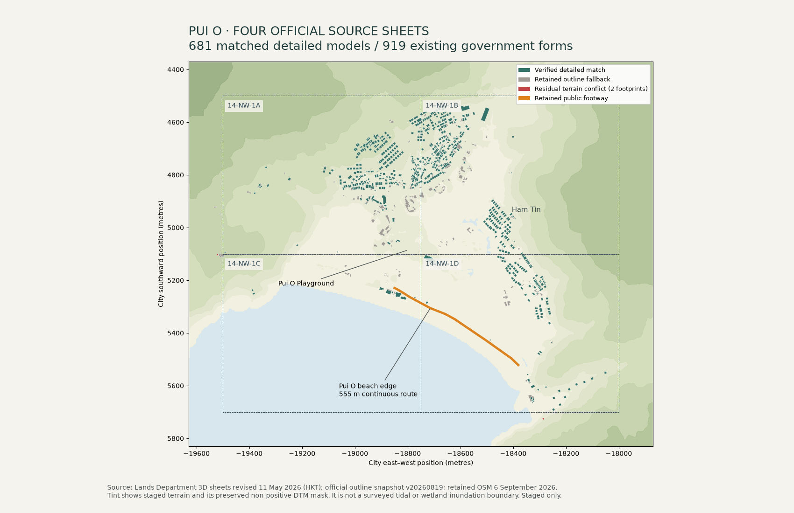

# Pui O village and beach edge · HKS-171

**Locally integrated and browser-checked; section 10.7 remains under review.** Four official sheets, `14-NW-1A/B/C/D`, cover the village, beach and wetland edge. The current index records 11 May 2026 HKT revisions. Their rectangle is HK1980 E815000–816500, N810800–812000. A 35 m matching buffer retains complete outlines at the edge: 919 existing government forms, including 911 with centres strictly inside the four sheet rectangles.

The source import found 685 building models. **681 match an existing UID/BuildingCSUID** using the unchanged GeoRefNo plus footprint-overlap/centroid screen; four remain excluded from automatic replacement. No footprints, source identities, recorded base/top elevations or source triangles were invented, shifted or deleted. The 681 matched forms have 79,618 triangles, with at most 903 triangles in one model. The 238 other selected forms retain their existing source outline fallback. [Build evidence](build.json) and [source terrain/height checks](source-audit.json) retain the exact identities and counts.



This exported diagnostic was inspected at its native 1700×1100 size. It shows the source footprint/model distinction and public route; it is not a GPU screenshot or a surveyed wetland boundary.

## Terrain and remaining source limits

The staged patch uses the already retained official whole-Hong-Kong 5 m DTM plus four source TINs through the existing resampler/mosaic. It is 379×323 vertices, 1,596,172 bytes, SHA-256 `9080c264dfa64eaaf9c1164a6806a98b05960c6247fb86840948eef2b1ad027e`. Its native georeference starts at E814802.5, N812197.5, with 5 m cells. An optional outer display-height transition preserves the existing coarse mesh join; raw elevation arrays remain separate.

The exact footprint/terrain audit changes **77 wholly-below and 125 partly-below roof flags to one and two**, respectively, when matched detailed models are active. Partial counts include wholly-below cases. The current TIN grid covers 898 selected footprint centres. All 681 detailed-model centres were also checked against their own native TIN triangles: none has its highest roof below the source terrain. Across 540 paired sheet-edge samples, maximum source-height disagreement is 0.0694 m. 358 source model roof extrema differ from approximate outline TopHeight by over 2 m; both source representations remain distinguishable rather than being forced into agreement.

Both residual conflicts are **unmodelled matching-buffer forms outside the four current TIN sheets**, where the archival DTM remains: `landsd/11179:0` has a recorded top of 9.6 m HKPD versus terrain 11.441–15.374 m; `landsd/182169:0` has top 78.9 m versus terrain 78.000–81.365 m. Their recorded elevations remain untouched. [The terrain audit](terrain-audit.json) lists every form, source coverage, fallback and proposed height field. Only **140 both-null source base/top estimates** follow the existing labelled terrain-estimate policy. Recorded government elevation fields are preserved. Outline fallback and detailed-model conflict results are not interchangeable.

The four unmatched models are `B155941180201062G0`, `B158801178801062G0`, `B160851170701062G0` and `B160871172101062G0`. Two lack a matching retained GeoRefNo; two have the same reference but fail the existing geometric overlap screen. Neighbouring candidates are diagnostic only and are recorded in the terrain audit.

[Pui O's freshwater and brackish habitats](https://sslo.cedd.gov.hk/en/exploring-more/nature-conservation/environment-biodiversity/index.html) include a connected stream, marsh, mudflat and mangrove system. This package preserves the existing non-positive DTM water mask; it does not flatten those habitats into a tide plane or infer present inundation/bathymetry. Current shoreline/channel mapping and water behaviour remain a separate acceptance item. No archived Lantau imagery was used as precise current geography.

## Compact model package and verification

Use `source-scripts/city/pui-o-completion/compact/catalogue.json` and its `models/` folder. The 455,211-byte catalogue is below the shared 1 MiB limit. Its 681 gzip GLBs total **1,291,802 bytes**, with 6,139,344 decoded GLB bytes and 5,327,736 geometry-buffer bytes. The existing packer preserves native nodes/materials and bit-identical expanded position/normal/colour attributes. [Compact evidence](compact-assets.json) includes source hashes and per-asset counts. The baked 31.2 MB JSON payload is retained for source auditing; publication deliberately avoids embedding it into city tile `-10_2`.

The actual shared compact loader accepted every model, including byte/hash/source identity and placement checks. Every model passed source-UID ray picking, exact model-triangle collision and clearance above its roof. Actual terrain-mesh verification checked 122,417 vertices and 1,400 perimeter nodes; maximum rendered perimeter mismatch was 0.00000043 m. [Runtime evidence](runtime-verification.json) is CPU-only. The conservative all-model resident budget is 68.4 MB; the existing loader must apply its request/LOD/cache limits instead of eagerly fetching 681 small assets. The bounded GPU/browser checks below now pass; they do not replace the separate source-wide CPU checks.

[The retained public footway](https://www.openstreetmap.org/way/107501760) follows 555.066 m of beach edge. [The current Islands District Office page](https://www.islands.gov.hk/en/explores-lantau-south-pui-o-beach.php) supports the beach's public visitor context; exact coordinates come from OSM. Continuous forward and reverse runs each use 8,546 actual Navigation frames, one initialisation and zero waypoint resets. High water blocks entry, and both existing `puio` / `puiobeach` arrivals remain accepted without relocation. [Route evidence](route-navigation.json) retains all source nodes and input hashes. The inland village connection requires a separate shared-road review; this route does not imply private wetland access or complete Chi Ma Wan coverage.

## Rebuild and publish

Run from `/Users/williamli/projects/wiiiimm/hongkong-sandbox-astra-city` with the retained selection inputs:

```sh
/tmp/astra-city-venv/bin/python source-scripts/city/pui-o-completion/run.py fetch
/tmp/astra-city-venv/bin/python source-scripts/city/pui-o-completion/run.py build
/tmp/astra-city-venv/bin/python source-scripts/city/pui-o-completion/run.py terrain
/tmp/astra-city-venv/bin/python source-scripts/city/pui-o-completion/run.py source-audit
/tmp/astra-city-venv/bin/python source-scripts/city/pui-o-completion/audit.py
/tmp/astra-city-venv/bin/python source-scripts/city/pui-o-completion/routes.py
/tmp/astra-city-venv/bin/python source-scripts/city/pui-o-completion/compact.py
node source-scripts/city/pui-o-completion/route_audit.mjs
node source-scripts/city/pui-o-completion/runtime_verify.mjs
/tmp/astra-city-venv/bin/python source-scripts/city/pui-o-completion/test_models.py
/tmp/astra-city-venv/bin/python source-scripts/city/pui-o-completion/publish.py
```

Six Python checks pass; compact runtime validation covers all 681 models and the route checks both directions. `run.py select` was used once to create the retained pre-publication selection from the full official source; it is not needed for ordinary rebuilds. Original source archive size was 131,042,322 bytes; the shared range downloader transferred only 8,537,928 bytes, retaining 8,218,408 bytes of compact source cache. No source photo was imported.

**The root agent executed the following local publication command successfully:**

```sh
/tmp/astra-city-venv/bin/python source-scripts/city/pui-o-completion/publish.py --apply
```

It verifies source identities and retained hashes, copies the patch to `3d-viewer/city/data/terrain-pui-o.json`, copies compact assets to `3d-viewer/city/data/official-models/pui-o/`, and calls the existing territory publisher with an empty embedded-model map. That updates the 919 selected forms' terrain diagnostics and the 140 labelled missing-elevation estimates while preserving foundations and recorded source fields. The catalogue URL `city/data/official-models/pui-o/catalogue.json` is appended to `manifest.officialModelCatalogues`. Existing catalogue URLs, all other terrain patches, coarse terrain/hydro regions, source models and unrelated forms remain intact. The wrapper checks these preservation conditions afterwards. [The publication record](publication.json) confirms that all 346,115 forms, existing patch and hydro bytes, recorded source fields and other catalogue entries were preserved. The current integration has 718 progressive models (37 Central/corridor plus 681 Pui O), separately from the existing 1,859 embedded models. The retained dry-run/source audits describe the pre-publication staging checkpoint.

## Actual viewer acceptance

The bounded browser run passed in the normal city viewer at 1440×1000 and in a fresh 390×844 mobile session. It first checked the published catalogue/terrain hashes, then verified all 132 tracker sections, the counts of 0 Ready / 0 Close / 12 Under review / 120 Base, and section 10.7’s HKS-171 link. The grid was disabled before scene and frame-time checks. [The full browser record](browser/verification.json) retains the app state, inputs, source UIDs and measured results.

Three source-backed village models passed actual picking, source-card attribution and live collision checks; their measured placement errors were below 0.002 m. Shared night materials compiled and showed lit windows. Both original arrivals entered walking without relocation/collision, the actual held-key beach walk covered 3.05 m along the retained public footway, and a 94.03 m flight returned to Explore. The separate 555.07 m bidirectional CPU Navigation replay remains the longer continuous-route evidence; the browser test does not claim that whole route was walked interactively.

The deliberately failed model download kept a visible, pickable official-outline fallback. The real Retry control restored the correct sourced roof geometry and source card. No JavaScript page errors or unexpected city-data HTTP failures occurred. The fresh mobile session used the mobile model profile, not a resized desktop profile; Time controls fit without horizontal overflow. Desktop and mobile frame samples each measured a 16.7 ms median and 16.8 ms p95 over 119 intervals on this local machine. The sampled caches held 48 desktop / 24 mobile detailed models, within their budgets (4.92 MB / 2.62 MB conservative resident estimates); these are local short samples, not device-wide frame-rate guarantees.

The exported images were inspected at their native sizes: [village day](browser/village-overview-day-1440x1000.png), [village night](browser/village-overview-night-1440x1000.png), [beach](browser/beach-day-1440x1000.png), [mobile day](browser/village-mobile-clean-day-390x844.png), [mobile night](browser/village-mobile-clean-night-390x844.png), [source card](browser/west-village-source-1440x1000.png), [download fallback](browser/failed-model-visible-fallback-1440x1000.png) and [recovered model](browser/failed-model-recovered-1440x1000.png). Detailed roof setbacks and terraces are visible, while façade/window patterns remain illustrative. The beach export still shows the inherited stepped grid shoreline; wetland boundaries, water behaviour, inland shared-road connections and the two out-of-sheet roof conflicts remain explicit acceptance gaps.

To reproduce this bounded browser run after coordinated local publication and a GPU release:

```sh
node source-scripts/city/pui-o-completion/browser.mjs
```

No new renderer was introduced. This Pui O slice is delivered; broader HKS-171 remains In Progress for shoreline work, village connections and other south-Lantau areas. The larger section has not been promoted to Ready or Close to ready.
