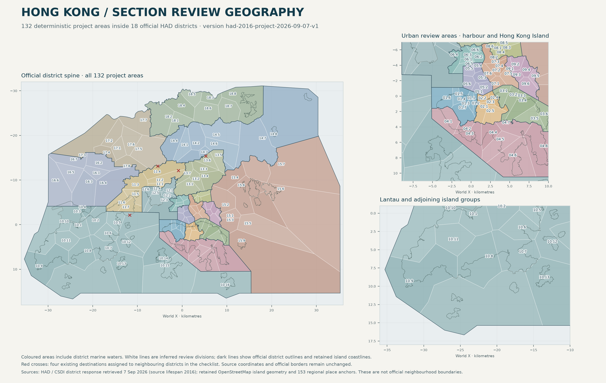

# Versioned project review geography · HKS-194

The new `3d-viewer/city/data/review-sections.json` contains all **132 checklist sections**, partitioned within the **18 official Home Affairs Department (HAD) district polygons**. These are approximate **project review areas**, not official neighbourhood boundaries, electoral constituencies, land parcels or public-access limits. They do not establish readiness: the renderer's separate readiness data owns that assessment.

Version: `had-2016-project-2026-09-07-v1`. Prepared by the Astra geography subagent in the existing Astra worktree; root owns runtime integration, browser checks and the final commit. No archival reference map was modified or used as an exact boundary source.

## Sources and dates

The [official DATA.GOV.HK resource](https://data.gov.hk/en-data/dataset/hk-had-json1-hong-kong-administrative-boundaries/resource/855f034a-c330-435c-a911-1d63538a6d55) links to CSDI dataset `had_rcd_1634523272907_75218`. The [official service layer](https://portal.csdi.gov.hk/server/rest/services/common/had_rcd_1634523272907_75218/MapServer/0?f=pjson) supplies native EPSG:2326 district geometry. `sources/` retains the original service metadata, layer metadata, full feature response and independent ID response. All 18 advertised OBJECTIDs exactly match the downloaded features. `source-manifest.json` records the URLs, original byte counts and SHA-256 hashes.

The response was obtained on **7 September 2026**. Every record has `BEGIN_LIFESPAN` = 1 January 2016; the service exposes no later geometry revision field. The version's `had-2016` component identifies this source lifespan, **not a claim that the data was surveyed in 2016 or revised in 2026**. A future source refresh must be reviewed before changing the version.

These district outlines include substantial **marine jurisdiction areas**. Keeping their complete extent makes offshore islands and waters part of the review inventory. The polygons are not coastline-only land masks and must not be used to create terrain, infer dry walking surfaces or suggest that coloured sea is land.

Island constraints reuse the two retained regional OSM snapshots and their source geometry, with exact snapshot hashes in output provenance. The existing island configuration supplies the major Lantau/airport/Lamma/Peng Chau/Cheung Chau/Soko/Po Toi/Tai Po island grouping. Additional named footprint rules cover Ma Wan, Tsing Yi, Ap Lei Chau, Port Shelter islands, Tung Lung Chau, Jin Island and the north-eastern North District islands. OpenStreetMap contributor attribution and ODbL-1.0 apply. Optional broader OSM queries timed out; **no unavailable response is used or claimed**.

## Deterministic subdivision

1. Read all 132 stable IDs and names from the section checklist; map their 18 district numbers to official HAD area codes.
2. Use all **153 retained regional place coordinates**, before any adjusted walking spawn. For the four outside-district destinations below, keep the source coordinates and derive a partition-only seed five metres inside the intended district. This does not relocate the destination.
3. Calculate Euclidean Voronoi cells in metre coordinates, clip to each complete official district and union cells sharing a section ID. The method produces review divisions, not researched street-by-street neighbourhood borders.
4. Apply **26 source island footprints**, yielding **27 district-clipped ownership constraints**. Only the checklist's permitted sections can own each constrained island piece. Smaller footprints take priority where source outlines overlap. Twenty-one additional interior points derived from single-owner island footprints help assign nearby offshore waters to their intended group.
5. Preserve all geometry components and holes. Do not independently simplify or round shared boundaries. Output retains the source numerical coordinates and deterministic intersection results; numerical precision does not imply equivalent real-world accuracy. World coordinates are `x = E − 834500`, `z = 816500 − N`.

Soko (Tai A Chau and Siu A Chau), Po Toi and the other retained offshore-group footprints explicitly belong to `10.16`, never Tai O `10.10`. Lantau is split between the official Islands and Tsuen Wan district parts; Ma Wan stays `11.5`, and Tsing Yi's island footprint stays within `12.4`–`12.6`. Other small or unnamed islets are geographically covered by the full district partition, but their individual neighbourhood association remains inferred. Straight inferred boundaries can cross roads, mountains and bays; this first version is an organised review framework, not a claim that every neighbourhood extent is settled.

## Recorded source/checklist conflicts

| Requested section | Existing destination | Actual HAD district | Distance outside requested district |
| --- | --- | --- | ---: |
| 11.4 | Tai Mo Shan visitor centre | Yuen Long | 58.50 m |
| 13.7 | Lead Mine Pass trail connection | Tsuen Wan | 1,357.42 m |
| 14.3 | Science Park waterfront anchor | Sha Tin | 243.84 m |
| 11.7 | Disneyland Resort pier | Islands | 699.18 m |

The other **149 destinations are inside their assigned polygons**. Exact source coordinates, source links, actual districts and derived partition seeds are retained in `provenance.anchorExceptions` and `geography-audit.json`.

The retained Chek Lap Kok outline also intersects HAD Islands by approximately **18.31 km²** and HAD Tuen Mun by **2.79 km²**, around the northern airport reclamation. The checklist groups airport work under 10.3–10.4, but this source mismatch does not justify moving the official district border. The Tuen Mun portion remains in that district's inferred review partition and is recorded in `islandDistrictConflicts`. This is an explicit limitation when reviewing the airport as a whole.

## Output and verification

The final geometry has **147 polygon components, 39 holes and 23,233 vertices**. It is **1,015,412 bytes raw / 303,617 bytes gzip**. Each section supplies its stable ID, checklist name, district metadata, polygon rings, an interior label point, bounds, associated place IDs and source notes. It includes no status or readiness judgement. The final geometry SHA-256 is recorded in `geography-audit.json`.

Nine independent checks pass: all checklist IDs/names once; exact source IDs/hashes; finite valid closed polygons and interior labels; full district coverage; pairwise non-overlap; all 153 anchors accounted for; explicit island ownership and Soko/Po Toi regression; synthetic hole/multipart preservation; mobile payload budget and exact place inventory. Per-district symmetric differences and overlaps are below **0.000001 m²**, which is floating-point overlay noise rather than an assertion of cadastral accuracy.

The source-plan image was exported directly at **3000 × 1900 pixels** and inspected. It shows full district jurisdiction areas, internal review divisions, retained island outlines and the four conflicting source destinations. Crowded urban label positions use fine leader lines; the data label positions remain unchanged. Browser/GPU performance and interactive selection are separately checked by root against the integrated renderer.

## Reproduce

Run from the Astra worktree. Python dependencies are Shapely 2.1+, pyproj, numpy and matplotlib. The current environment uses `/tmp/astra-city-venv/bin/python`.

```sh
/tmp/astra-city-venv/bin/python source-scripts/city/review-sections/fetch.py
/tmp/astra-city-venv/bin/python source-scripts/city/review-sections/build.py
/tmp/astra-city-venv/bin/python source-scripts/city/review-sections/test_geography.py
/tmp/astra-city-venv/bin/python source-scripts/city/review-sections/plot.py
```

The first command validates retained bytes without refetching; `fetch.py --refresh` explicitly obtains fresh official responses and therefore requires a new source review/version. The builder publishes through an atomic replacement of only the new review-section data file. Existing terrain, models, walking arrivals, regional sources and runtime files remain untouched by this geography pass. Root's `build_readiness.py` shares the folder and remains separately owned.


