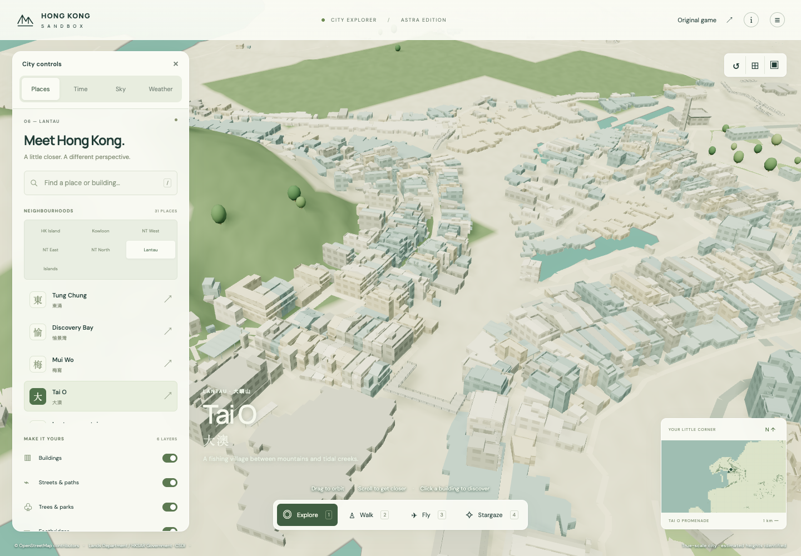
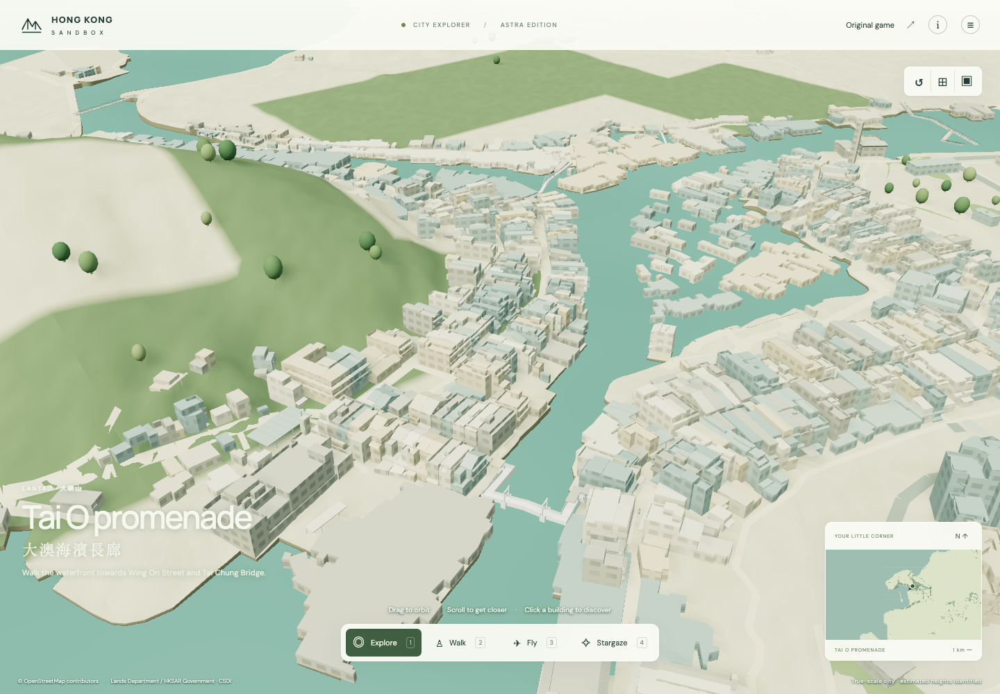

# Tai O channels, bridges and continuous village walk · HKS-170

The city now opens Tai O's tidal channels along current government map boundaries, renders five original Lands Department infrastructure models, and supports a continuous public walk from the promenade through Wing On Street, Tai Chung Bridge and the village streets. Existing building identities, models and recorded heights remain intact.

This extends the 532-building model pass in `72df3cf`. Heisenberg supplied the hydro/terrain pass, Curie supplied source infrastructure, Kant corrected collision and public access and verified the route, and root integrated the actual app, inspected exports and completed browser acceptance. Work remains on the isolated `codex/astra-hong-kong-city` comparison branch.

## Before and after

The earlier view at the same camera shows terrain filling the channels. The current view uses sourced shore boundaries and original bridge geometry.

| Before this completion pass | After |
| --- | --- |
|  |  |

[Day](browser/channels-day-1440x1000.png) · [Night](browser/channels-night-1440x1000.png) · [Mobile viewport](browser/channels-mobile-390x844.png) · [Bridge](browser/tai-chung-bridge-1440x1000.png) · [Walk finish](browser/continuous-walk-finish-1440x1000.png)

## Coverage and implementation

| Item | Verified result |
| --- | --- |
| Territory building/structure forms | 346,115; every source tile remains byte-identical to the baseline |
| Government coverage | 342,223 source IDs represented by 342,225 polygon components |
| Retained OSM forms | 3,890 |
| Detailed government buildings | 1,859: 1,327 Mui Wo and 532 Tai O |
| Tai O building slice | 1,030 forms; 498 outline fallbacks, with three unmatched source models accounted for in the earlier model audit |
| Original infrastructure | Five models, 2,806 triangles, 8,418 expanded vertices; original coordinates, normals, colours and HKPD heights retained |
| Walking decks | Two verified public bridges; 51 selected original top triangles |
| Estimated public approaches | Two, visible and collidable; original bridge rails remain intact |
| Preserved saved arrivals | All 190 pass; only Tai O promenade moves 8.302 m along retained public mapping |

The shared terrain sampler and renderer use exact cut-cell geometry and the existing tide/wave shader. The minimap uses the same mapped channels. Building collision now follows actual model surfaces outside the solid source footprint, leaving street space beside rotated houses open. The streamed aircraft-height query includes source geometry above an outline's recorded height. The existing bridge layer handles source loading, batching, picking and verified walking faces; proxies are suppressed only after successful replacement loading.

## Verification

- Actual `Navigation.update` traverses about 607 m in both directions, with one initial spawn per run and zero position resets. Removing bridge floors blocks the route at mapped water. Raising the tide blocks submerged street entry.
- The actual app browser traverses **607.73 m** across 2,459 reviewed points without a collision or route failure. Source bridge picking, both estimated approach search/cards, aerial/day/night and 390 × 844 presentation pass with no page errors or failed city-data requests.
- Final browser samples: **16.7 ms median, p95 at most 16.8 ms**, on local desktop Chrome at 1440 × 1000 and a mobile-sized viewport. This is not a physical handset benchmark.
- The final combined city suite passes **162/162 checks**, including actual route replay regressions, source geometry, stair construction, water access and streamed aircraft clearance.
- Source-preservation, exact transformed-model, cut-cell geometry, route-source and saved-arrival evidence is linked below. Unit checks alone are not used as proof of a traversable route.

## Explicit limits

The water bed at −4 m is illustrative, not bathymetry. Two short public bridge approaches are estimated between sourced street/deck anchors. The Wing On source map and source mesh disagree at the entry: the visible connector uses the existing mesh opening and has a separately documented 1.73 m maximum deviation from the OSM shortcut. Ordinary street adjustments remain at most 0.30 m. Two source-confirmed canopies with missing measured heights retain their source records while their displayed clearance is explicitly estimated.

The mapped water intersects 106 retained forms; only one has detailed source geometry, and 102 appear above a diagnostic 0.3 m water surface. Individual house-pile positions and private deck access are not established. Original infrastructure supports are preserved, but unsupported waterfront fallbacks remain a documented visual limitation. No blanket house piles or private walking access are invented. This completion pass does not sign off every north-west Lantau settlement or all 132 regional review sections.

## Evidence and reproduction

- [Hydro sources, terrain cuts and preservation](hydro-README.md)
- [Original infrastructure, estimated approaches and stilt inventory](infrastructure-README.md)
- [Public-route sources, alignment and replay](route-README.md)
- [Continuous Navigation results](route-navigation.json)
- [Actual app browser results](browser/verification.json)
- [Whole-territory preservation](hydro-preservation.json)

Run from the worktree:

```sh
node --test 3d-viewer/city/tests/*.test.js
node source-scripts/city/tai-o-completion/route_navigation.mjs
node 3d-viewer/city/tests/tai-o-completion-browser.mjs
/tmp/astra-city-venv/bin/python source-scripts/city/tai-o-completion/hydro_preservation.py
/tmp/astra-city-venv/bin/python source-scripts/city/tai-o-completion/infrastructure-test.py
```

Source-specific rebuild commands and hashes are retained in the linked reports and `source-scripts/city/tai-o-completion/`. Generated geometry never edits the archived reference set. Government mapping remains attributed to Lands Department / HKSAR Government; retained OSM routes and forms retain OpenStreetMap attribution.
